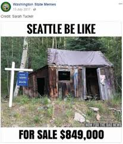
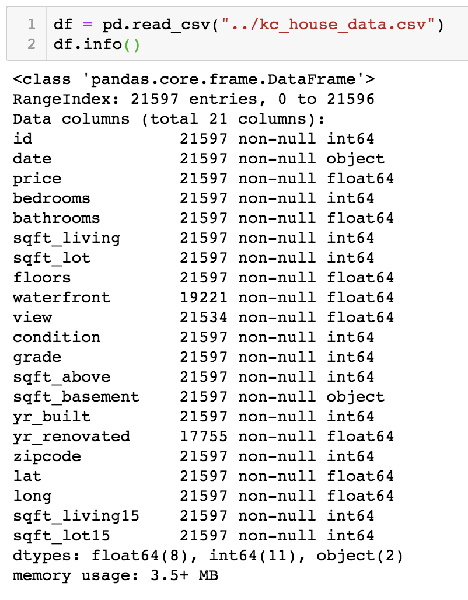
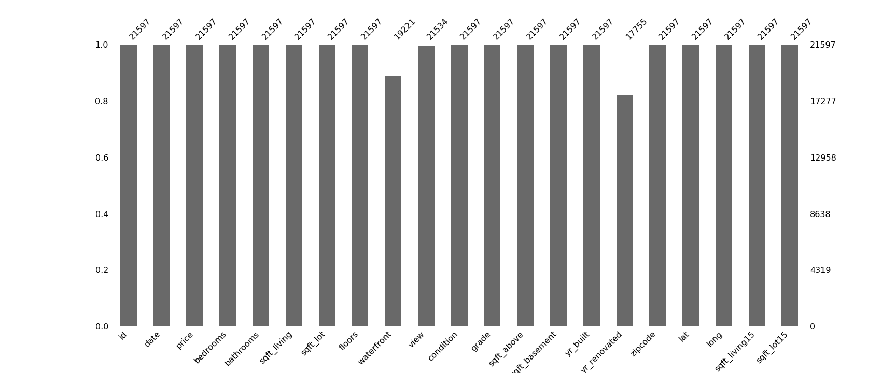
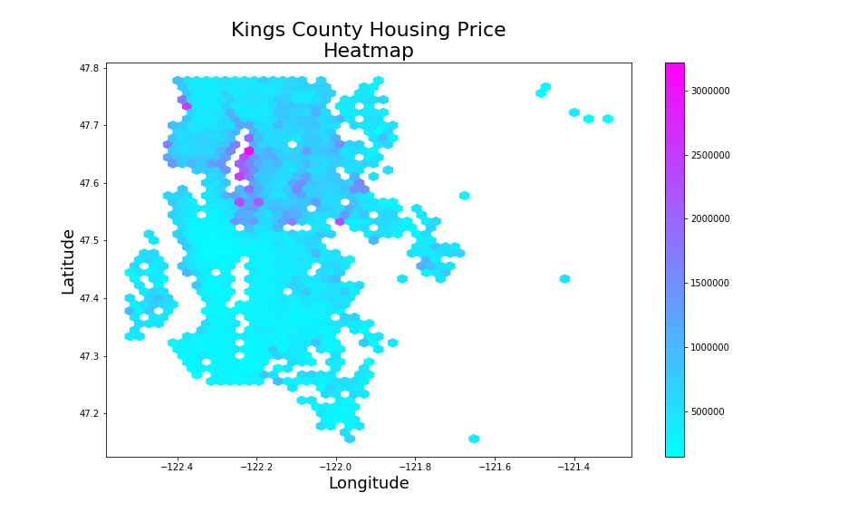

# Table Of Contents
* [Motivation](#Motivation)
* [Dataset Overview](#Dataset-Overview)
* [Question 1](#Q1)
* [Question 2](#Q2)
* [Question 3](#Q3)
* [Final Model](#Final-OLS-Model)
* [Recommendations](#Recommendations)
* [Future Work](#Future-Work)

# Presentation
<iframe width="560" height="315" src="https://www.youtube.com/embed/TVq2ivVpZgQ" frameborder="0" allow="accelerometer; autoplay; encrypted-media; gyroscope; picture-in-picture" allowfullscreen></iframe>

# Motivation
In this project, I perform linear regression on the `kings_county` housing dataset. blah blah

# Dataset Overview

<!---
## Info

--->

## Null Values

# Q1
'write question 1 here'

## EDA
show some graphs

## Observations
....

## Conclusion 

## Recommendation

# Q2

# Q3

# Final OLS Model
- Summary

- Insights

- Parameters

- Interpretation

- Residuals

# Recommendations
* 
* 
* 

# Future Work
* 
* 
* 
