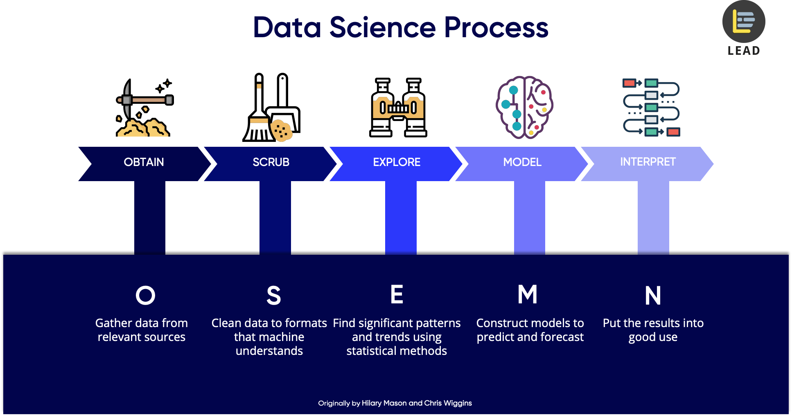

## Final Project Submission

Please fill out:
* Student name: 
* Student pace: self paced / part time / full time
* Scheduled project review date/time: 
* Instructor name: 
* Blog post URL:


```python
# Your code here - remember to use markdown cells for comments as well!
```



# Scrubbing Data
What should we check for when scrubbing data
* dtypes
* placeholder values
* null values
    * how to handle them
* outliers

# Explore
* Ask questions first
    * literally any question
* Provide 4 vis that you use for gaining insight

# Modeling
- use statsmodels to model data and check assumptions
- after you build a well conditioned and verified model in statsmodels
    - build it and cross validate it in sklearn
    - plot your residuals and check their normality 
        - check normality using QQPlot

# Interpret
- 3 recommendations
- Further Work
- Overall conclusion of what you think about the housing market in kings county (seattle, wa)
